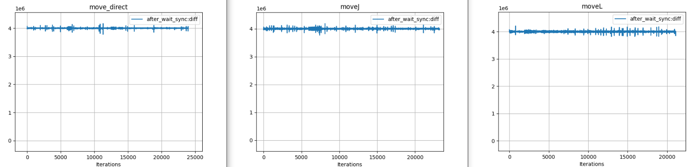
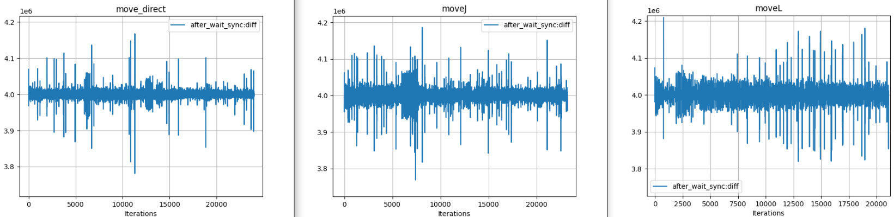

# Kord-performance-analysis
This repository contains tools for analyzing the performance of the Kord API, specifically focusing on the timing of various functions and their impact on real-time control loops.

**Files:**

**ex_move_linear:** Example code for linear movement with timing measurements.

**ex_move_joints:** Example code for joint movement with timing measurements.

**diff_api.py:** Python script to visualize timing differences using matplotlib.

**ex_move_direct:** Example code for direct joint control movement with timing measurements.

**ex_joints_changes:** Patch file demonstrating modifications made to the example code for timing analysis.

**Analysis Process:**

**Modifications to Example Code:** The example code files (ex_move_linear and ex_move_joints) are modified to include:

- Pre-allocation of arrays for efficiency.
- Recording of raw timestamps before and after key operations (waitSync, moveJ/moveL, fetchData).

**Data Collection:** Run the modified example code to collect timing data for each iteration of the control loop. This data is saved to a CSV file (stats_file_kord_api.csv).

**Visualization:** Import the CSV data into your preferred data analysis tool (e.g., Excel, MATLAB, Python with pandas and matplotlib).

**Analysis:** Analyze the timing data and visualizations to understand the performance characteristics of the Kord API and its impact on real-time control. This information can be used to optimize control loops and improve the overall performance of robot applications.

**Additional Notes:**

- The ex_joints_changes file shows the specific modifications made to the example code for timing analysis.
- The ex_move_direct file provides an example for analyzing the timing of direct joint control movement.
- The analysis process can be applied to other Kord API functions and examples to gain a comprehensive understanding of performance.

| Domain | Stamp |Mean [µs] | Median [µs] | Standard deviation [µs] | Maximum [µs] | Minimum [µs] |
|---|---|---|---|---|---|---|
| Joints | after_wait_sync | 4000.029 | 3999.934 | 11.973 | 4186.266 | 3768.783
| Linear | after_wait_sync | 4000.024 | 3999.927 | 12.603 | 4209.904 | 3819.071
| Direct | after_wait_sync | 4000.030 | 3999.987 | 9.126 | 4167.625 | 3781.044
